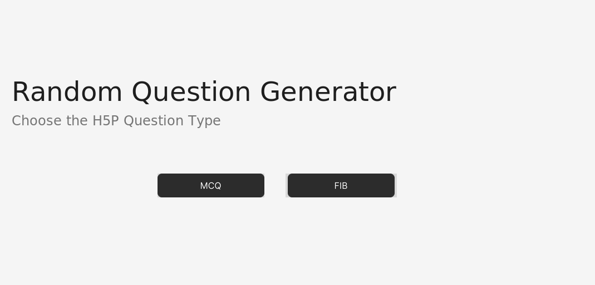
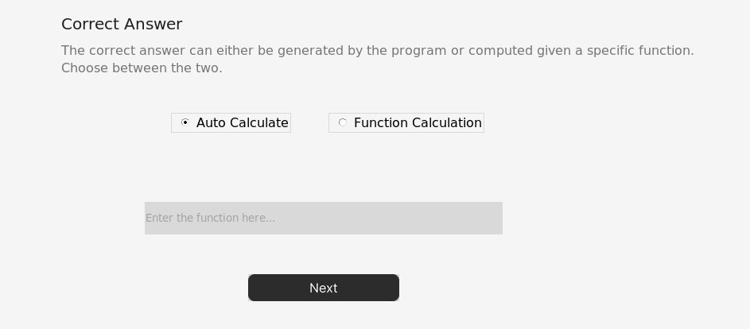
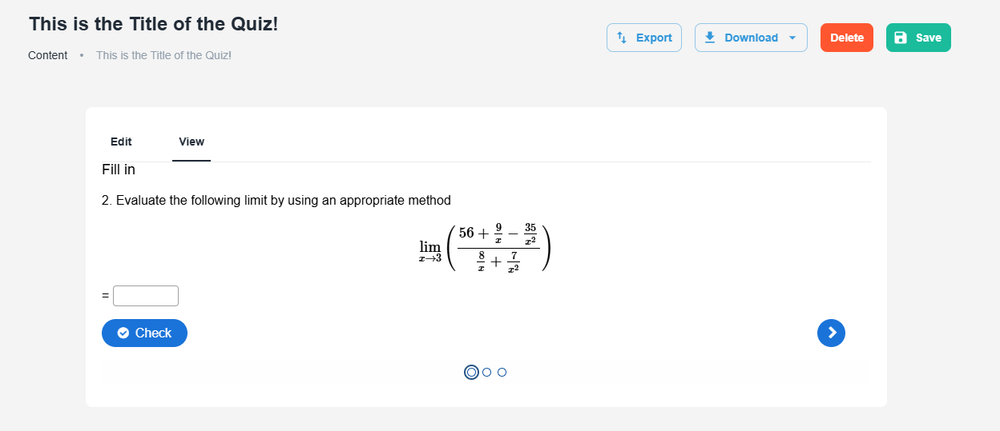
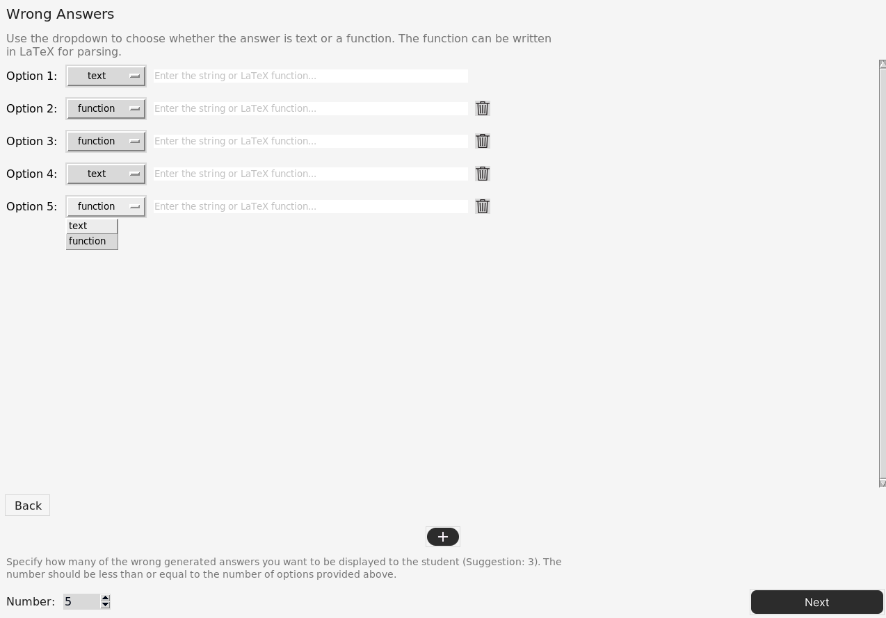
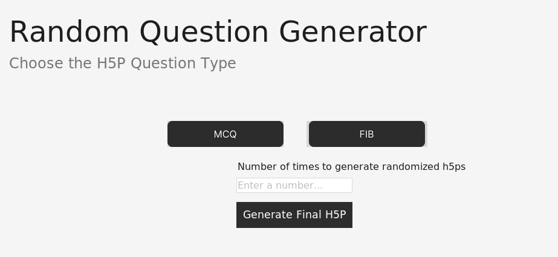
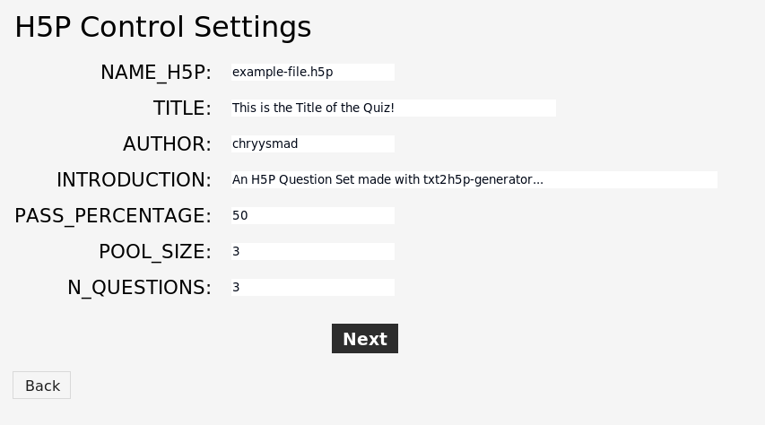

# randomq-generator

This repository contains a Python-based GUI application designed to help educators generate a pool of randomized .txt and [H5P](https://h5p.org) [Question-Set](https://h5p.org/question-set) files. The tool allows for customization of question parameters and automated generation of correct and incorrect answers. The questions can either be [Multiple Choice Questions](https://h5p.org/multichoice) with tips and right/wrong answer feedbacks or [Fill in the Blanks Questions](https://h5p.org/fill-in-the-blanks). 

### Notice 
This project was created by [chryysmad](https://github.com/chryysmad) and [shadygm](https://github.com/shadygm) as part of [Tamás Görbe's](https://www.rug.nl/staff/t.f.gorbe/?lang=en) Project Calculus, that aims for the creation of an adaptive educational tool that will enhance student engagement and success in Calculus. The application makes usage of the [txt2h5p-generator](https://github.com/chryysmad/txt2h5p-generator). 

This project is licensed under the Creative Commons Attribution-NonCommercial-ShareAlike 4.0 International License. 

## Major Features

1. **Randomized Question Generation:**  
Define custom parameters (e.g. range, step, exclusions) to automatically randomize values and generate multiple variants of each question.

<div align="center">
  
</div>

2. **Support for Multiple Question Types:**  
Seamlessly create both Multiple-Choice (MCQ) and Fill-in-the-Blank (FIB) questions, with dynamic generation of answer choices based on the randomized parameters.

<div align="center">
  
</div>

3. **LaTeX & Sympy Integration:**  
Use LaTeX to format mathematical expressions and leverage Sympy for parsing, substituting and evaluating these expressions, ensuring precise computation.
<div align="center">
  
</div>

4. **Automated File Output:**  
Automatically generate multiple versions of a question. Generates output files in both JSON and plain text formats, facilitating easy review and integration with other educational tools.

<div align="center">
  
</div>

5. **H5P File Generation:**  
Converts the generated text files into interactive H5P content, enhancing the delivery of educational materials with engaging digital formats.

<div align="center">
  
</div>

6. **Ability to Set Wrong Answer(s):**   
Provide alternative (incorrect) answer choices manually by either setting a specific text or function, allowing the tool to assist you in generating them. 
<div align="center">
  
</div>

7. **Automatic Generation of H5Ps**:  
Automatically generate multiple randomized versions of an H5P question set using the built-in backend engine. Each set is generated with different parameters and values, ensuring varied learning content for each student.

<div align="center">
  
</div>

8. **H5P Control File Parameter Setting:**    
Configure key metadata and parameters for H5P packages, such as title, number of questions per set or author name. 

<div align="center">
  
</div>


## Project Structure

```plaintext
randomq-generator/
├── build/
│   ├── control.py 
│   ├── correct.py    
│   ├── wrongs.py 
│   ├── randomizer.py   
│   ├── parameters.py    
│   ├── intro.py   
│   └── assets/            # Button and entry field UI images
├── backend/
|   ├── logic.py           # Shared backend logic functions for question generation and formatting
|   ├── util.py            # Helper functions used across the backend modules
│   └── txt2h5p/           # Converter for txt questions into H5P format
├── data/
│   ├── output1.json       # Sample output file in JSON format 
|   ├── output1.txt        # Sample output file in txt format 
|   └── example-file.h5p   # Sample generated H5P question set
├── misc/                  # Miscellaneous scripts and documentation resources
|   ├── readme_images/ 
│   └── latex_test.py      # Experimental script for testing LaTeX-style question rendering
```

### Pages Overview

The application is organized into a series of GUI pages, each designed to handle a specific part of the question generation process. Below is a brief description of what each page does:

* `intro.py`: This is the introduction page, or else the welcoming screen that introduces the user to the tool. It outlines the purpose of the GUI and guides them on how to get started.
* `control.py`: The control page contains the GUI that manages the key metadata and parameters for H5P question sets created. This page functions as a "Settings" page as well. 
* `parameters.py`: This page allows users to define and customize generation parameters (such as range, step and exclusions) which determine how many and what kind of variants of each question will be created.
* `correct.py`: The correct answers page provides an interface for users to input the correct answer functions that will serve as the foundation for generating the correct answers to the questions. The users are also able to choose the auto-generation option, where no input is needed. 
*  `wrongs.py`: This page enables users to specify the type of wrong answers to be generated. It supports manual entry of both function and text-based options. This page does not show up in the case that the user wants to generate FIB (Fill-in-Blanks) questions. 
* `randomizer.py`: The randomizer page combines the inputs from the other pages and executes the core logic to create a pool of randomized questions, ensuring each variant is unique and properly formatted.


## Getting Started 
To get a local copy up and running, follow these steps

### Prerequisites
* **Linux Terminal/Command Prompt:** Access is necessary to run the Python commands.
* **Python 3.x:** Required for the script to run and can be downloaded from the [official website](https://www.python.org/downloads/).


### Setting up 
1. Clone the repository.
```
git clone https://github.com/chryysmad/randomq-generator.git
```

### Running the Script
1. Enter the directory in which the cloned repository is located from your terminal.
```
cd randomq-generator
``` 

2. Install the dependencies.
```
pip install -r requirements.txt
```

3. Run the command.
```
python3 main.py 
```


<a rel="license" href="https://creativecommons.org/licenses/by-nc-sa/4.0/">
  
</a><br />
<span xmlns:dct="http://purl.org/dc/terms/" property="dct:title">randomq-generator</span> by 
<a xmlns:cc="http://creativecommons.org/ns#" href="https://github.com/chryysmad" property="cc:attributionName" rel="cc:attributionURL">chryysmad</a> and 
<a xmlns:cc="http://creativecommons.org/ns#" href="https://github.com/shadygm" property="cc:attributionName" rel="cc:attributionURL">shadygm</a> 
is licensed under a 
<a rel="license" href="https://creativecommons.org/licenses/by-nc-sa/4.0/">Creative Commons Attribution-NonCommercial-ShareAlike 4.0 International License</a>.<br />
Based on a work at 
<a xmlns:dct="http://purl.org/dc/terms/" href="https://github.com/chryysmad/randomq-generator" rel="dct:source">https://github.com/chryysmad/randomq-generator</a>.
